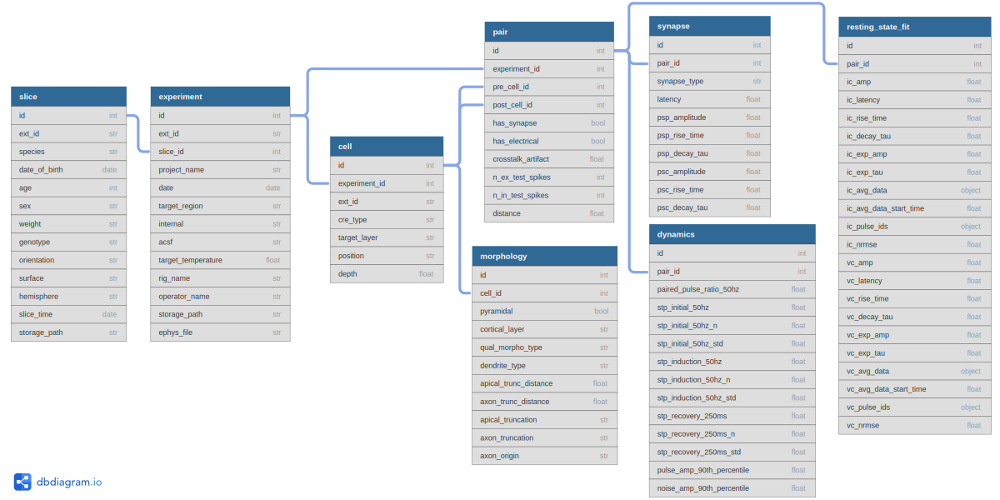

.. _dataset_structure:

Dataset Structure
=================

The `Synaptic Physiology dataset <https://portal.brain-map.org/explore/connectivity/synaptic-physiology>`_ contains the results of 8-channel multipatch recordings made from cortical slices. More information about the experimental protocols can be found on `our website <https://portal.brain-map.org/explore/connectivity/synaptic-physiology/synaptic-physiology-experiment-methods>`_ and in our `eLife publication <https://elifesciences.org/articles/37349>`_. 

At the most basic level, we organize the data from these experiments into several hierarchical levels:

1. **slice** : experiments are performed on one slice of cortical tissue at a time, and in our dataset each slice has associated metadata describing the source of the tissue -- the species (human or mouse), brain location, and any transgenic reporters that should be expressed in the slice.

2. **experiment** : in this dataset, one experiment represents a session in which up to 8 electrodes were used to simultaneously patch cells in a specific region of the slice. In some cases, multiple experiments are performed on the same brain slice, but such experiments are always spatially and temporally isolated from each other. In other words, we can expect to find evidence of synaptic connections between cells _within_ an experiment, but never _between_ experiments.

3. **cell** : each experiment contains data recorded from multiple cells (usually 2-8 cells). A cell is associated with a particular electrode, and thus may be linked to the stimuli that were delivered to the cell and the responses that were recorded from it. Cells also carry metadata describing some of their morphological properties (including somatic location within the cortex), and indicating the presence of fluorescent transgenic markers.

4. **pair** : the main purpose of this dataset is to describe the interactions between cells. We define a ``pair`` as being a _potential_ connection from one specific cell to another (so any two cells A and B will have two associated pairs: A->B and B->A). For each pair, the dataset describes a rich set of results including whether the pair has a chemical or electrical synapse, the analyzed kinetic properties of synapses if present, and "snippets" of stimulus-response trials that took place between the cells.

5. **pulse response** : for the most part, synaptic connections are characterized by evoking an action potential in one cell (the "presynaptic" cell in a pair) while simultaneously recording the activity in another cell (the "postsynaptic" cell in a pair). In this dataset, a ``pulse_resposnse`` is defined as one such trial -- a single presynaptic stimulus, some number of presynaptic spikes (but usually just 1), and a postsynaptic recording that may or may not contain evidence of a synaptic response. Each ``pulse_response`` may be associated with short snippets of the raw pre- and postsynaptic recording data as well as the results of analyses that were performed on that data.

Access to the dataset is provided mainly via `sqlite <https://www.sqlite.org/about.html>`_ relational database files that contain one table for each of the hierarchical levels listed above (plus many others). The original, complete recording data are also available as one `HDF5 <https://support.hdfgroup.org/HDF5/whatishdf5.html>`_ file per experiment; however, these are only recommended for use in cases where it is necessary to access data that are not already represented in the relational database files, or when verifying that the database results accurately reflect the original data. 

Due to the large sqlite and HDF5 file sizes, we recommend downloading these files via our API, which will automatically cache downloaded files and attempt to resume failed downloads in case of interruption. We also offer sqlite files in `three different sizes <https://portal.brain-map.org/explore/connectivity/synaptic-physiology/interact#database>`_ to allow faster downloads for more limited use cases. Instructions for accessing the relational database files :ref:`can be found here <database_access>`.

Relational Database Tables
--------------------------

Our relational database structure reflects the hierarchical arrangement described above plus several tables that carry data associated with each level:

   Most commonly used subset of tables in the database. Click for a larger / clickable version.

The figure above describes a subset of the tables present in our database; for a full description of tables and columns, see the :ref:`database schema API documentation <api_schema>`.
